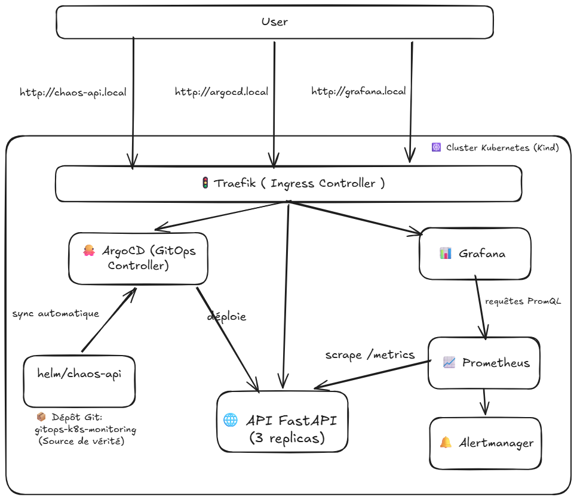
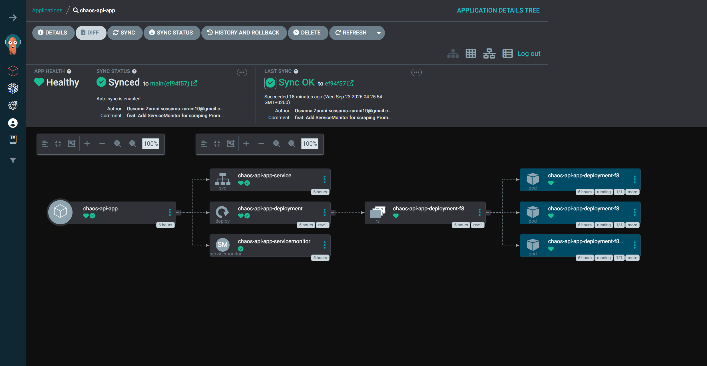
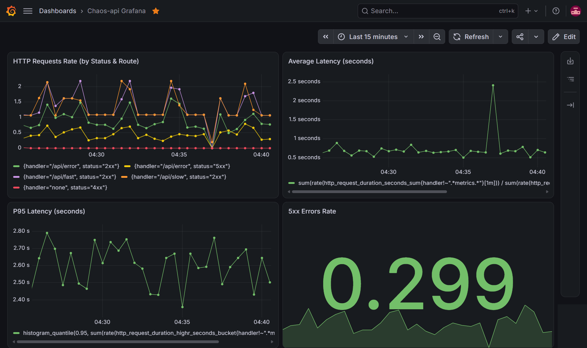
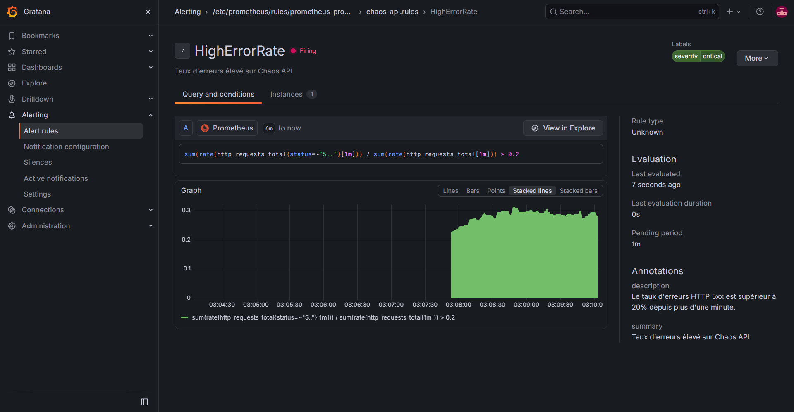
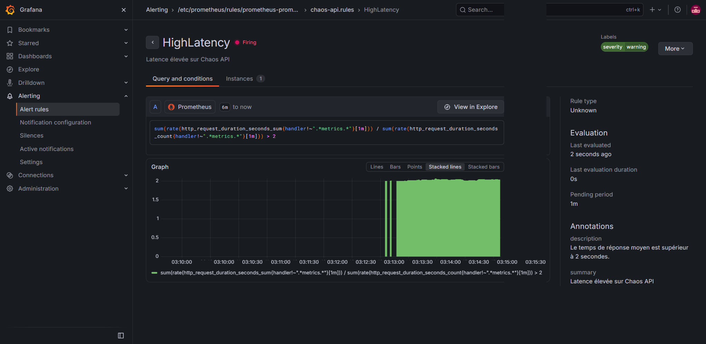

# Chaos API — GitOps Kubernetes Monitoring Stack

Plateforme de démonstration **GitOps** déployant une API FastAPI (« Chaos API ») sur un cluster **Kubernetes local (Kind)**, entièrement synchronisée via **ArgoCD**, exposée via **Traefik (Ingress Controller)** et supervisée avec **Prometheus et Grafana**.

L'objectif est d'implémenter un cycle **GitOps de bout en bout avec ArgoCD**, un routage unifié sans `port-forward` via **Traefik**, une stack de monitoring **Prometheus/Grafana** automatisée par opérateurs (CRDs), ainsi que des tests d'injection de pannes (**Chaos Engineering**) pour valider les métriques et alertes en conditions réelles.

## Architecture du projet



---

## Prérequis

Avant de lancer le projet, assurez-vous d'avoir installé les outils suivants sur votre machine (Windows, Linux ou macOS) :

| Outil | Description |
|---|---|
| **Docker** | Moteur de conteneurs, requis par Kind 
| **Kind** | Crée un cluster Kubernetes local dans des conteneurs Docker 
| **Helm** (v3+) | Gestionnaire de packages Kubernetes 
| **Make** | Automatise les commandes du projet (voir section dédiée) 

> ⚠️ **Important** : Docker doit être **démarré** (Docker Desktop sous Windows/macOS) avant d'exécuter `make up`, car Kind crée le cluster sous forme de conteneurs Docker.

### Ports requis

Le fichier `kind-config.yaml` mappe les ports **80** et **443** de votre machine hôte vers le cluster (pour Traefik). Assurez-vous qu'**aucun autre service** (IIS, Apache, Nginx, un VPN, etc.) n'écoute déjà sur ces ports avant de lancer `make up`.

---

## Installation

### 1. Cloner le projet

```bash
git clone https://github.com/OsZa99/gitops-k8s-monitoring.git
cd gitops-k8s-monitoring
```

### 2. Installer `make`

`make` est nativement disponible sous Linux/macOS, mais doit être installé manuellement sous Windows.

#### Linux (Debian/Ubuntu)

```bash
sudo apt update
sudo apt install -y make
```

#### Windows

Deux options possibles, au choix :

**Option A — via Chocolatey (recommandé)**

```powershell
# Installer Chocolatey si nécessaire : https://chocolatey.org/install
choco install make
```

**Option B — via WSL2 (recommandé pour la suite du projet)**

Comme ce projet utilise des scripts Bash (`scripts/setup.sh`), il est fortement recommandé d'utiliser **WSL2 (Windows Subsystem for Linux)** plutôt que PowerShell/CMD natif :

```powershell
wsl --install
```

Puis, à l'intérieur de votre distribution WSL (Ubuntu par exemple) :

```bash
sudo apt update && sudo apt install -y make curl docker.io
```

> 💡 Docker Desktop pour Windows propose une intégration directe avec WSL2 (à activer dans *Settings > Resources > WSL Integration*), ce qui évite d'avoir à réinstaller Docker dans la distribution.

#### Vérifier l'installation

```bash
make --version
```

### 3. Lancer l'environnement

Une seule commande suffit pour tout créer, de A à Z (cluster, Traefik, Prometheus/Grafana, ArgoCD, et le déploiement de l'application) :

```bash
make up
```

Cette commande exécute le script [`scripts/setup.sh`](./scripts/setup.sh), qui réalise **6 étapes automatisées** :

1. **Création du cluster Kind** (`kind create cluster`) à partir de `kind-config.yaml`
2. **Installation de Traefik** (Ingress Controller) via Helm
3. **Installation de Prometheus & Grafana** (`kube-prometheus-stack`) via Helm
4. **Installation d'ArgoCD** (manifests officiels + Ingress + activation du mode `insecure` pour l'accès HTTP local)
5. **Déploiement de la Chaos API** via l'`Application` ArgoCD (GitOps)
6. **Récupération des mots de passe** générés pour ArgoCD et Grafana

⏱️ Le processus prend généralement **entre 4 et 6 minutes**, selon votre connexion et votre machine (téléchargement des images Docker, des charts Helm, etc.).

À la fin, vous devriez voir un récapitulatif similaire à :

```
============================================================
🎉 ENVIRONNEMENT PRÊT !
============================================================
🌐 API FastAPI : http://chaos-api.local/api
📊 Grafana     : http://grafana.local (admin / <mot-de-passe>)
🐙 ArgoCD      : http://argocd.local (admin / <mot-de-passe>)
============================================================
```

> 📝 **Conservez ces identifiants**, ils ne sont affichés qu'une seule fois lors de l'exécution de `make up`.

#### ⚠️ Configurer le fichier `hosts`

Les URLs `chaos-api.local`, `grafana.local` et `argocd.local` ne sont pas des domaines publics : elles doivent être résolues localement. Ajoutez ces lignes à votre fichier hosts :

**Linux / macOS** — éditez `/etc/hosts` :
```bash
sudo tee -a /etc/hosts <<EOF
127.0.0.1 chaos-api.local
127.0.0.1 grafana.local
127.0.0.1 argocd.local
EOF
```

**Windows** — éditez `C:\Windows\System32\drivers\etc\hosts` **en tant qu'administrateur** et ajoutez :
```
127.0.0.1 chaos-api.local
127.0.0.1 grafana.local
127.0.0.1 argocd.local
```

---

## 🛠️ Commandes Make disponibles

Le [`Makefile`](./Makefile) centralise toutes les actions du cycle de vie du projet :

```bash
make help
```

| Commande | Description |
|---|---|
| `make up` | Crée le cluster Kind et installe tout l'environnement de A à Z |
| `make down` | Supprime **complètement** le cluster Kind (`kind delete cluster`). Toutes les données sont perdues |
| `make start` | Redémarre les conteneurs Docker d'un cluster **existant** mais arrêté |
| `make stop` | Arrête les conteneurs Docker du cluster **sans le supprimer** (les données sont conservées) |
| `make traffic` | Lance une simulation de trafic continu (requêtes rapides, lentes et en erreur) contre la Chaos API |
| `make test` | Test unitaire rapide : vérifie que l'endpoint `/api/fast` répond correctement |

---

## Fonctionnement du projet

### La Chaos API

La Chaos API est une application **FastAPI** volontairement instable, conçue pour générer des signaux d'observabilité intéressants. Elle expose 3 endpoints :

| Endpoint | Comportement |
|---|---|
| `GET /api/fast` | Répond instantanément, sans latence ni erreur |
| `GET /api/slow` | Simule une latence aléatoire **entre 1 et 3 secondes** |
| `GET /api/error` | Échoue avec une erreur **HTTP 500** dans environ **33% des cas** |

Elle expose également un endpoint `/metrics` (via [`prometheus-fastapi-instrumentator`](https://github.com/trallnag/prometheus-fastapi-instrumentator)), scrappé automatiquement par Prometheus grâce à un `ServiceMonitor`.

L'application est packagée en image Docker et déployée avec **3 replicas** via le chart Helm.

### L'Ingress Controller (Traefik)

**Traefik** agit comme point d'entrée unique du cluster. Il écoute sur les ports **80/443** de la machine hôte (mappés par Kind) et route chaque requête HTTP en fonction du nom d'hôte (`Host`) demandé :

| Host | Redirigé vers |
|---|---|
| `chaos-api.local` | Service `chaos-api` |
| `argocd.local` | Service `argocd-server` |
| `grafana.local` | Service `prometheus-stack-grafana` |

### ArgoCD (GitOps)

**ArgoCD** implémente le modèle **GitOps** : le dépôt Git est la unique source de vérité de l'état désiré du cluster.

La ressource [`argocd/application.yaml`](./argocd/application.yaml) déclare une `Application` ArgoCD qui :
- pointe vers ce dépôt Git (`repoURL`) et le chemin `helm/chaos-api`,
- est synchronisée automatiquement (`syncPolicy.automated`),
- **auto-corrige** toute dérive manuelle (`selfHeal: true`) — si quelqu'un modifie une ressource directement avec `kubectl`, ArgoCD la remet en conformité avec Git,
- **supprime les ressources obsolètes** (`prune: true`) qui ne sont plus définies dans Git.

➡️ Concrètement : **modifier un fichier dans `helm/chaos-api/` et le pousser sur `main` suffit à déclencher un redéploiement automatique**, sans intervention manuelle sur le cluster.

### Prometheus & Grafana

Le chart officiel **`kube-prometheus-stack`** installe l'ensemble de la chaîne d'observabilité :

- **Prometheus** collecte les métriques exposées par la Chaos API (`/metrics`) toutes les 15 secondes, grâce au `ServiceMonitor` défini dans [`helm/chaos-api/templates/servicemonitor.yaml`](./helm/chaos-api/templates/servicemonitor.yaml).
- **Grafana** interroge Prometheus (PromQL) pour afficher des dashboards visuels.
- **Alertmanager** reçoit les alertes déclenchées par les règles Prometheus et gère leur cycle de vie (`Pending` → `Firing`).

Les règles d'alerte sont définies en tant que ressource Kubernetes native `PrometheusRule` ([`helm/chaos-api/templates/prometheusrule.yaml`](./helm/chaos-api/templates/prometheusrule.yaml)) :

| Alerte | Condition | Sévérité |
|---|---|---|
| `HighErrorRate` | Taux d'erreurs HTTP 5xx **> 20%** pendant **> 1 minute** | `critical` |
| `HighLatency` | Latence moyenne **> 2 secondes** pendant **> 1 minute** | `warning` |

---

### Accéder à ArgoCD

**URL** : [http://argocd.local](http://argocd.local)
**Utilisateur** : `admin`
**Mot de passe** : affiché à la fin de `make up`, ou récupérable à tout moment avec :

```bash
kubectl -n argocd get secret argocd-initial-admin-secret -o jsonpath="{.data.password}" | base64 -d
```



Dans l'interface, vous devriez voir l'application `chaos-api-app` avec un statut :
- **Sync Status** : `Synced` ✅
- **Health Status** : `Healthy` 💚

### Accéder à Grafana

**URL** : [http://grafana.local](http://grafana.local)
**Utilisateur** : `admin`
**Mot de passe** : affiché à la fin de `make up`, ou récupérable à tout moment avec :

```bash
kubectl get secret prometheus-stack-grafana -n monitoring -o jsonpath="{.data.admin-password}" | base64 -d
```



Un dashboard préconfiguré est disponible et contient 4 panels :

1. **HTTP Requests Rate** (par statut et route)
2. **Average Latency** (latence moyenne, en secondes)
3. **5xx Errors Rate** (taux d'erreurs 5xx)
4. **P95 Latency** (95e percentile de latence)

---

## Génération de trafic

Pour observer des métriques et graphiques dynamiques dans Grafana sans intervention manuelle, un script génère du trafic en continu :

```bash
make traffic
```

Ce script ([`scripts/generate_traffic.sh`](./scripts/generate_traffic.sh)) envoie, en boucle, **150 requêtes simultanées** (50 vers chaque endpoint : `/api/fast`, `/api/slow`, `/api/error`), puis observe une pause de 30 secondes avant de recommencer.

```bash
while true; do
  for i in {1..50}; do
    curl -s http://chaos-api.local/api/fast > /dev/null &
    curl -s http://chaos-api.local/api/slow > /dev/null &
    curl -s http://chaos-api.local/api/error > /dev/null &
  done
  wait
  sleep 30
done
```

Laissez cette commande tourner dans un terminal dédié, puis ouvrez Grafana dans un autre onglet pour observer les courbes évoluer en temps réel. Arrêtez avec `Ctrl+C`.

---

## Tests des alertes Prometheus

Les deux tests suivants permettent de déclencher volontairement les alertes configurées dans [`prometheusrule.yaml`](./helm/chaos-api/templates/prometheusrule.yaml) et d'observer leur cycle de vie dans Grafana : **Normal (vert) → Pending (jaune) → Firing (rouge)**.

> 💡 Ouvrez **Grafana → Alerting → Alert rules** dans un onglet avant de lancer les tests, pour suivre l'évolution en direct.

### Test 1 : Déclencher l'alerte d'erreurs 5xx (`HighErrorRate`)

**Règle** : le taux d'erreurs 500 doit dépasser **20%** pendant plus d'**1 minute**.

```bash
while true; do curl -s http://chaos-api.local/api/error > /dev/null; echo -n "."; sleep 0.1; done
```

Cette boucle martèle l'endpoint `/api/error`, qui échoue dans ~33% des cas — largement suffisant pour franchir le seuil de 20%.

**Résultat attendu** : dans **Grafana → Alerting → Alert rules**, l'alerte `HighErrorRate` passe de :
1. `Normal` (vert) 🟢
2. → `Pending` (jaune) 🟡 — la condition est vraie mais le délai `for: 1m` n'est pas encore écoulé
3. → `Firing` (rouge) 🔴 — l'alerte est officiellement déclenchée





### Test 2 : Déclencher l'alerte de latence (`HighLatency`)

**Règle** : la latence moyenne doit dépasser **2 secondes** pendant plus d'**1 minute**.

```bash
while true; do for i in {1..10}; do curl -s http://chaos-api.local/api/slow > /dev/null & done; echo -n "."; sleep 1; done
```

Cette boucle envoie 10 requêtes concurrentes par seconde vers `/api/slow`, dont la latence simulée (1 à 3s) fait rapidement grimper la moyenne au-dessus de 2 secondes.

**Résultat attendu** : même cycle de vie que le Test 1 pour l'alerte `HighLatency` — `Normal` → `Pending` → `Firing`.



> ⏹️ N'oubliez pas d'arrêter les boucles `while true` (`Ctrl+C`) une fois les tests terminés : l'alerte repassera à `Normal` après ~1 minute sans dépassement du seuil.

---

## Dashboards Grafana

Le dashboard fourni ([`grafana/Chaos-api Grafana-*.json`](./grafana)) peut être importé manuellement si besoin (`Grafana → Dashboards → New → Import`, puis coller le contenu du fichier JSON). Il regroupe :

| Panel | Requête PromQL | Utilité |
|---|---|---|
| HTTP Requests Rate | `sum(rate(http_requests_total{handler!~".*metrics.*"}[1m])) by (status, handler)` | Voir le volume de requêtes par route et par code HTTP |
| Average Latency | `sum(rate(http_request_duration_seconds_sum{handler!~".*metrics.*"}[1m])) / sum(rate(http_request_duration_seconds_count{handler!~".*metrics.*"}[1m]))` | Suivre la latence moyenne globale |
| 5xx Errors Rate | `sum(rate(http_requests_total{status=~"5.."}[1m])) or vector(0)` | Isoler le volume d'erreurs serveur |
| P95 Latency | `histogram_quantile(0.95, sum(rate(http_request_duration_highr_seconds_bucket{handler!~".*metrics.*"}[1m])) by (le))` | Identifier les requêtes les plus lentes (95e percentile) |

---

## Nettoyage / Arrêt

| Besoin | Commande |
|---|---|
| Pause courte (le cluster reste en place) | `make stop`, puis `make start` pour reprendre |
| Suppression totale (repartir de zéro) | `make down` |

---

## Auteur

Ossama Zarani
